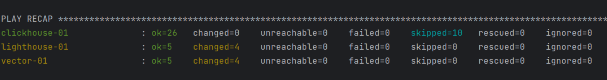

#### Описание  
Предыдущий прейбук переработан для использования ролей:  
- Созданы репозитории с ролями [Vector](https://github.com/atasenko/vector-role) и [Lighthouse](https://github.com/atasenko/lighthouse-role), в них перенесены tasks, handlers, vars.  
- Добавлен файл [requirements.yml](playbook/requirements.yml) с перечислением необходимых для работы ролей.  
- Удалены все лишние файлы и папки.  
- [site.yml](playbook/site.yml) исправлен. В нем описана установка Clickhouse, Vector и Lighthouse с использованием ролей.  
- В задании этого не было, но измененный плей отработал на тестовой инфраструктуре  

