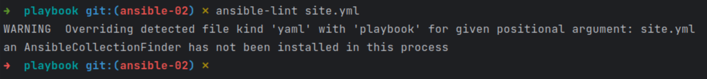
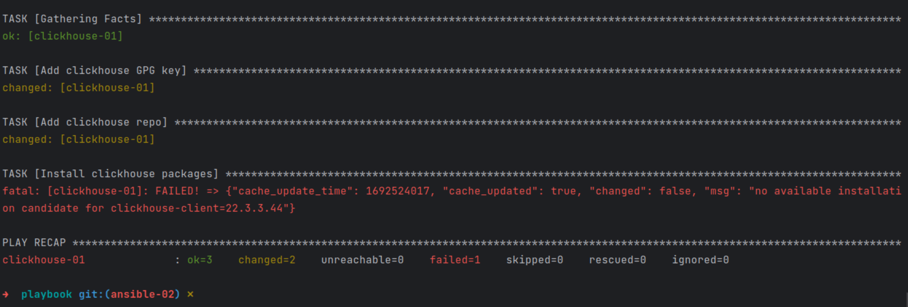
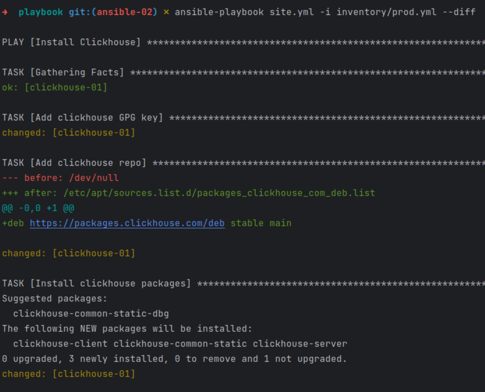
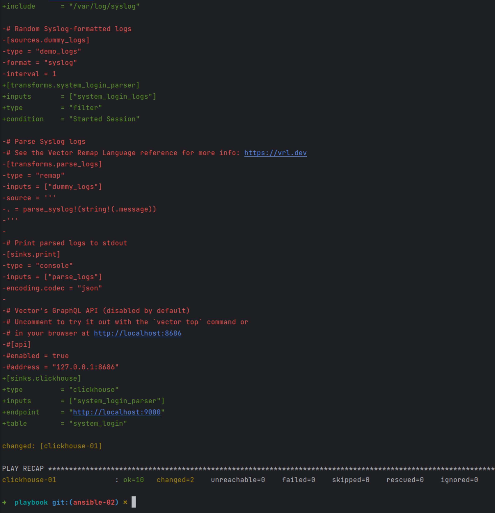
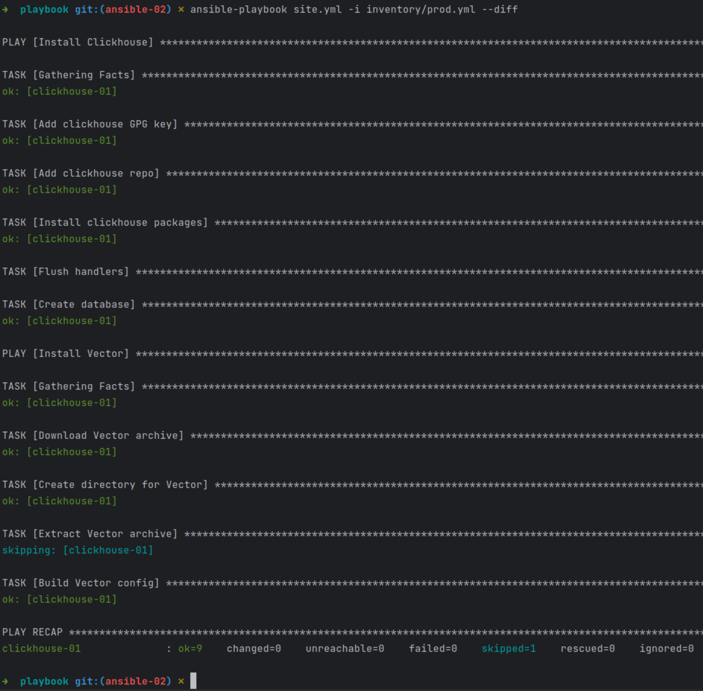

#### Подготовка хоста.  
Для создания хоста в этот раз использовал Terraform и Yandex Cloud. Уже была заготовлена Ubuntu, получил внешний IP, вписал в prod.yml, увидел что playbook рассчитан на Centos.  
Решил быстренько переписать путь в репозиторий Clickhouse для deb пакетов и... Не нашел где их скачать. [Официальная документация](https://clickhouse.com/docs/ru/getting-started/install) дает [ссылку](https://packages.clickhouse.com/deb/pool/stable) если я хочу скачать пакеты вручную которая выдает Not found.  
Ладно, меняю ОС на Centos 8 stream - получаю:
"fatal: [clickhouse-01]: FAILED! => {"changed": false, "msg": "Failed to validate GPG signature for clickhouse-client-22.3.3.44-1.noarch: Package clickhouse-client-22.3.3.44.rpm is not signed"}"  
на этапе установки любого из трех пакетов.  
Решил не страдать с этими ошибками, а переписать весь [playbook](playbook/site.yml) для Ubuntu с установкой GPG ключа, репозитория и пакетов нужной версии.  
Позже нашел путь к нужным дистрибутивам, но оставил как есть, для разнообразия подходов.  
#### Дописать playbook.  
Сделан еще один play Install Vector который:  
1. Скачивает архив Vector (этап можно пропустить, модуль unarchive может скачать его сам если указать url архива вместо пути).  
2. Создает директорию /opt/vector куда этот архив будет распакован.  
3. Распаковывает архив в созданную выше директорию, проверяя наличие пути. Если папки уже созданы, данные не будут перезаписаны.  
4. Собирает конфиг в формате toml из шаблона [vector.toml.tpl](playbook/vector.toml.tpl). Необходимые переменные указан в файле [vars.yml](playbook/group_vars/clickhouse/vars.yml). Переменная vector_apps может содержать несколько приложений, для каждого из них будут собраны собственные блоки в конфиге.  
#### Проверить запуском ansible-lint site.yml.  
Т.к. все ошибки синтаксиса и логики уже были устранены в процессе написания play, литер выдал только предупреждение:  
  
#### Запуск плейбука с флагом --check.  
Для чистоты эксперимента предварительно очистил inventory запуском terraform destroy и создал заново.  
Запуск завершился с ошибкой. Репозиторий фактически добавлен не был, поэтому поиск нужного пакета ничего не дает.  
  
#### Запуск с флагом --diff.  
Отображает подробные изменения которые были произведены при запуске плейбука:  
  
  
При повторном запуске изменений нет:  
  
