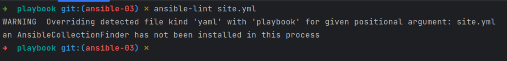
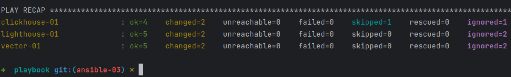
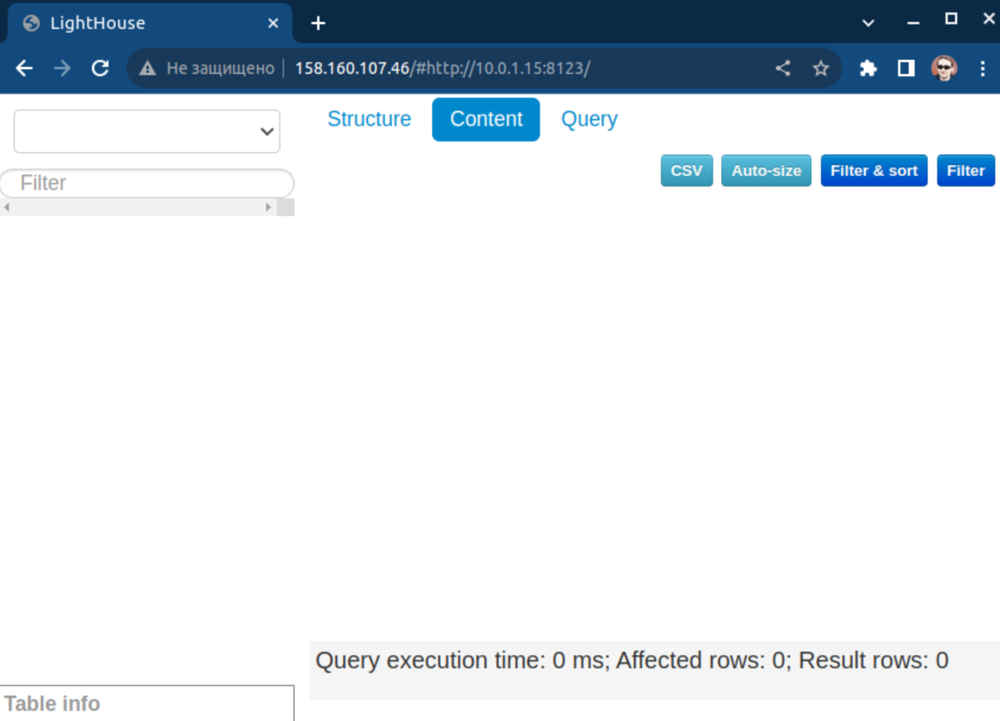
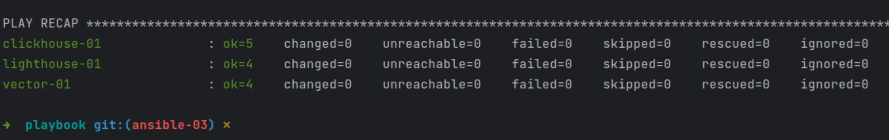

#### Задание 0.  
Допилил предыдущий плейбук. Вместо скачивания и распаковки архива (без установки) качаем и ставим *.deb, добавлен handler с перезапуском vector.  
#### Дописать в playbook задачу установки и настройки Lighthouse.  
Сделан еще один play Install Lighthouse который:  
1. Содержит handler для перезапуска nginx.
2. Стандартным модулем apt устанавливает git и nginx.  
3. Клонирует при помощи модуля git репозиторий Lighthouse заданный переменной lighthouse_repo в папку заданную lighthouse_dir.  
4. Собирает конфиг nginx при помощи модуля template из шаблона [default.tpl](playbook/default.tpl).  
5. Запускат nginx.  
#### Подготовить inventory.  
Как и в прошлый раз, [prod.yml](playbook/inventory/prod.yml) собран автоматически из [шаблона](terraform/prod.tftpl) в процессе содания машин Terraform`ом.  
Таким же образом можно подставлять новый внутренний IP ВМ Clickhouse в шаблон [vector.yml.tpl](playbook/vector.yml.tpl).  
#### Проверить запуском ansible-lint site.yml.  
Т.к. все ошибки синтаксиса и логики уже были устранены в процессе написания play, линтер выдал только предупреждение:  
  
#### Запуск плейбука с флагом --check.  
Для чистоты эксперимента предварительно очистил inventory запуском terraform destroy и создал заново.  
Для того чтоб обработать весь playbook добавлял в таски и хендлеры по мере появления ошибок параметр "ignore_errors: true".  
Вот результат:  
  
#### Запуск с флагом --diff.  
Предварительно удалил все добавленные на предыдущем этапе "ignore_errors: true".  
Все изменения которые были произведены при запуске плейбука собрал в [файл](ansible_diff.txt):  
Lighthouse открывается, но, т.к. связка vector-clickhouse не доделана до работоспособного состояния, БД пустая.  
  
При повторном запуске изменений нет:  
  
