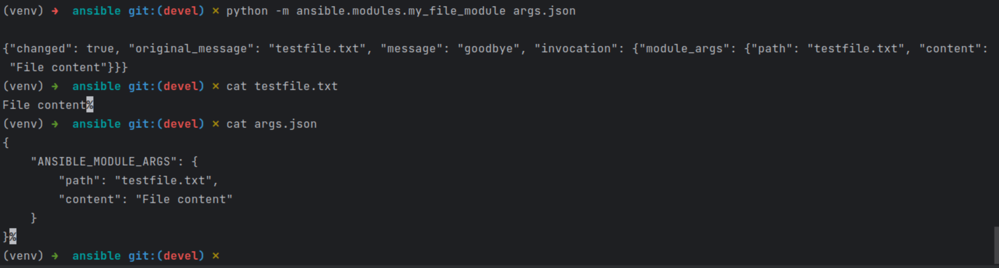
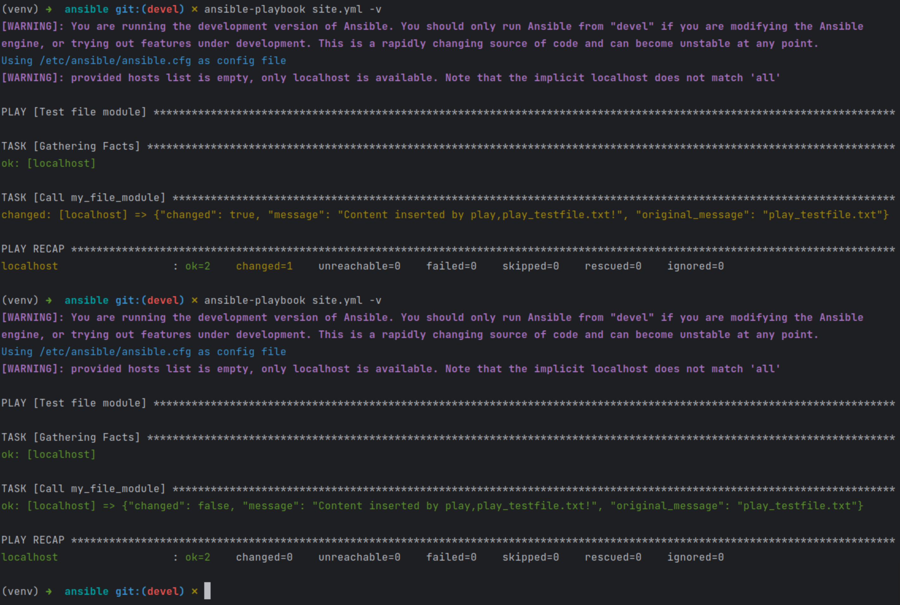
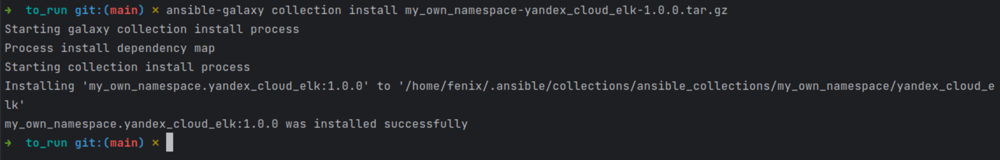
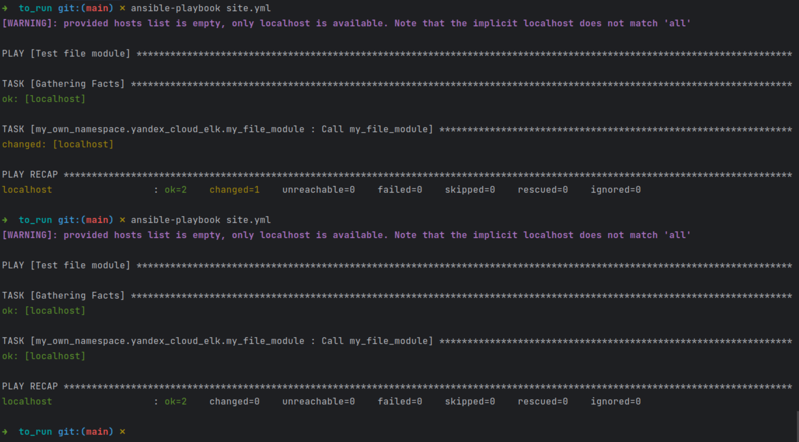

### Описание  
Репозиторий с коллекцией [здесь](https://github.com/atasenko/my_own_collection)  
[Архив](https://github.com/atasenko/my_own_collection/blob/main/my_own_namespace-yandex_cloud_elk-1.0.0.tar.gz)  
Код модуля [здесь](https://github.com/atasenko/my_own_collection/blob/main/my_own_namespace/yandex_cloud_elk/plugins/modules/my_file_module.py)  
Проверяю модуль на исполняемость локально:  
  
Проверяю на идемпотентность двойным запуском playbook:  
  
Установка коллекции из локального архива:  
  
Запуск плейбука с ролью из коллекции:  

[Плейбук](to_run/site.yml) и [результат](to_run/role_testfile.txt) его работы.
