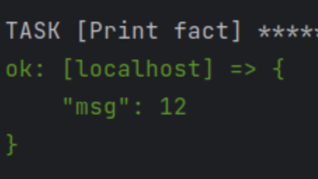
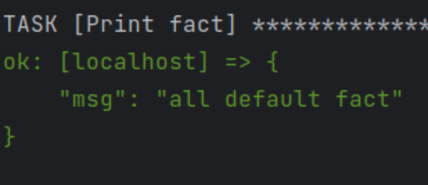
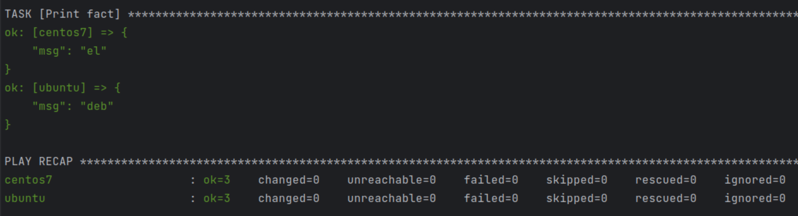
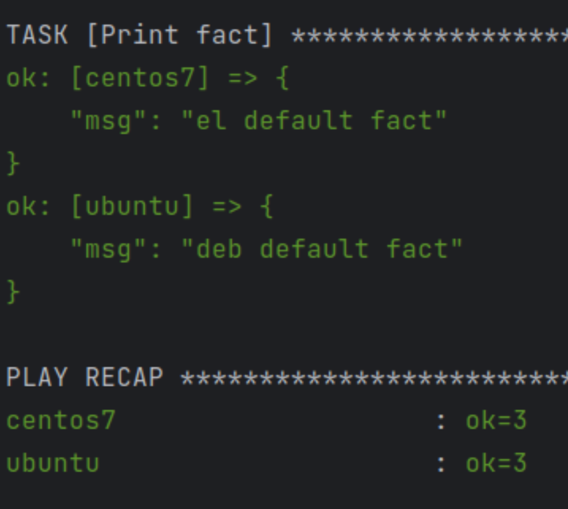
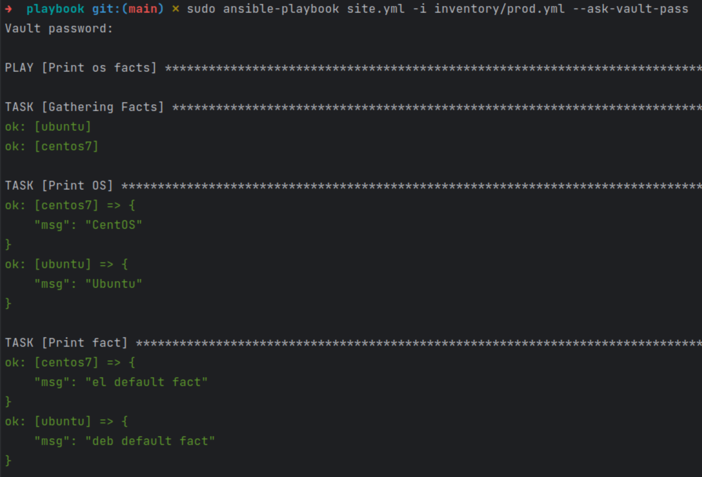

## Основная часть  
#### 1 - запустить playbook, зафиксировать значение которое имеет факт some_fact  
  

#### 2 - найти файл с переменными в котором задается найденное в первом пункте значение, изменить на "all default fact"  
  

#### 3 - не понял как воспользоваться подготовленным окружением, создал свое. Для простоты запустил в разных окнах терминала:  
sudo docker run -it --name=centos7 centos:7  
sudo docker run -it --name=ubuntu ubuntu  
И в ubuntu дополнительно  
apt update && apt install python3  

#### 4 - Запустить playbook для prod, зафиксировать полученные факты  
  

#### 5,6 - Изменить факты для обеих систем на "{{ old_fact }} default fact"  
  

#### 7,8 - Зашифровать факты, запустить с паролем  
Шифруем при помощи ansible-vault encrypt_string  
Запускаем sudo ansible-playbook site.yml -i inventory/prod.yml --ask-vault-pass  
  

#### 9 - Найти и посмотреть при помощи ansible-doc список плагинов для подключения, выбрать подходящий для localhost  
ansible-doc -t connection -l  
Для работы на control node подходит ansible.builtin.local  

#### 10-12 - Добавить новую группу хостов с localhost, запустить playbook, проверить факты  
  